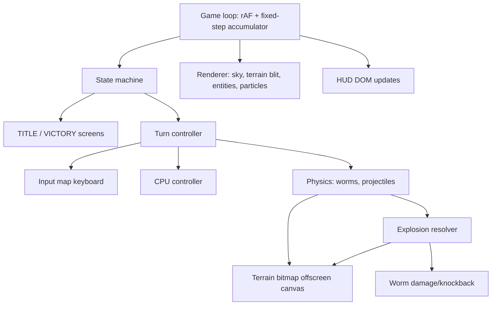

# Design Document

## Overview

A single-page, zero-dependency implementation of a Worms-style artillery game. All simulation and rendering live in `game.js`; `index.html` provides the canvas plus HUD/menu DOM skeleton; `style.css` styles the DOM chrome. Rendering uses one full-viewport `<canvas>` (Canvas 2D). The terrain is a per-pixel bitmap held in an offscreen canvas, which gives free destructibility (destroy = draw a transparent circle) and free rendering (blit the offscreen canvas).

Guiding decisions:

- **Fixed-timestep physics, variable-rate rendering.** The simulation steps at 120 Hz accumulated from `requestAnimationFrame` delta (clamped to 100 ms to survive tab switches). This keeps trajectories deterministic across machines — important for CPU aim prediction, which simulates the same integrator.
- **Terrain as pixels, entities as circles.** Worms and projectiles are circles tested against the terrain's alpha channel. No polygon meshes, no physics engine.
- **One explicit state machine** owns match flow. Every screen and turn phase is an enum value; input handlers check the current state first. This is the main defense for Requirements 3, 9.

## Architecture



### State machine

```
TITLE → PLACING(instant) → TURN_START → AIMING → CHARGING → PROJECTILE
      → RETREAT → SETTLING → TURN_END → (TURN_START | GAME_OVER) → TITLE/rematch
```

- `AIMING`: movement + aim + weapon select allowed; timer runs (45 s).
- `CHARGING`: Space held on a chargeable weapon; release or 100% fires. Instant weapons (Shotgun, Dynamite) skip this phase.
- `PROJECTILE`: input locked except retreat movement (Req 3.4 runs `RETREAT` concurrently as a 5 s sub-timer that starts at fire time).
- `SETTLING`: waits for all worms `atRest` and no live projectiles/particles-with-collision; hard cap 8 s (Req 9.2).
- `TURN_END`: applies drowning/death resolution, checks win/draw (Req 1.3/1.4), flips team.

All timers are decremented in the fixed step, never via `setTimeout`, so pausing/clamping delta cannot desync them (Req 9.4).

## Components and Interfaces

### Terrain (`Terrain`)

- Offscreen canvas `W×H` (playfield size, e.g. 1600×900 logical pixels) + cached `Uint8ClampedArray` of its alpha channel, rebuilt only on destruction (dirty-rect `getImageData` around the crater).
- `generate(seed)`: 1D height map from 3–4 octaves of value noise (or midpoint displacement); filled downward; grass band drawn along the top edge; water line at `H - waterHeight`.
- `solidAt(x, y) → bool`: alpha > 127 lookup; out-of-bounds left/right/top = air, below water = air (water kills separately).
- `carve(x, y, r)`: `globalCompositeOperation = 'destination-out'` circle, then re-stroke a darker rim ring clipped to remaining terrain (Req 2.5), then refresh alpha cache for the dirty rect.

### Entities

```js
Worm { id, team, x, y, vx, vy, hp, facing, aimAngle, alive, atRest, fallStartY }
Projectile { kind, x, y, vx, vy, fuse, windFactor, bounces, restitution, age, timeoutAt }
Particle { x, y, vx, vy, life, color, size }   // cosmetic only
```

### Physics (`stepPhysics(dt)`)

- Gravity `g` applied to airborne worms and all projectiles; bazooka adds `wind * windFactor` to `vx`.
- **Worm ground movement**: step-up walking — try move 1px horizontally; if blocked, try up to `MAX_STEP` (≈4 px) upward steps; if still blocked, stop (Req 4.1/4.2). Slopes steeper than the step allowance are walls.
- **Worm collision**: circle vs terrain sampled at 8 points; landing sets `atRest`, computes fall damage from `fallStartY` (damage = `max(0, (fallDist - SAFE_FALL) * k)`, Req 4.4).
- **Projectile collision**: swept sampling along the velocity each substep so fast shells cannot tunnel through thin terrain. Grenade/cluster reflect velocity about the terrain surface normal (estimated from alpha samples) with restitution ≈ 0.45.
- **Shotgun**: not a projectile — raycast in aim direction, march 2 px steps until worm/terrain/OOB hit; apply small carve + damage at hit point (Req 5.6).

### Explosion resolver (`explode(x, y, radius, maxDmg)`)

Single choke point (Reqs 2.2, 6.2, 6.3, 8.2):
1. `terrain.carve(x, y, radius)`.
2. For each living worm: `d = dist(worm, blast)`; if `d < radius + wormRadius`: damage `= maxDmg * (1 - d/radius)` (floored ≥ some minimum when overlapping), knockback impulse along the blast→worm vector scaled by damage; mark airborne, record `fallStartY` **after** knockback applies so knockback-induced falls hurt.
3. Spawn particles, screen-shake `= f(radius)`, floating damage numbers (Req 6.6).
4. Friendly fire: no team filter anywhere in this path (Req 6.7).

Deaths are **not** applied mid-flight; HP hits are, but death/gravestone/drowning resolution happens in `SETTLING → TURN_END`, so simultaneous kills resolve consistently for the draw rule (Req 1.4) and active-worm-death rule (Req 3.7).

### Weapons table (data-driven)

| id | key | charge | wind | fuse | maxDmg | radius | notes |
|----|-----|--------|------|------|--------|--------|-------|
| bazooka | 1 | yes | yes | impact | 50 | 55 px | |
| grenade | 2 | yes | no | 3 s | 45 | 50 px | restitution 0.45 |
| cluster | 3 | yes | no | 3 s | 30 + 5×15 | 40/25 px | bomblets inherit ±spread |
| shotgun | 4 | no | no | instant | 25 ×2 | 18 px | 2 rays per turn, turn ends after 2nd |
| dynamite | 5 | no | no | 3 s | 75 | 80 px | placed at feet |

One `WEAPONS` object drives selection UI, firing, and CPU reasoning — adding a weapon means adding a row plus at most one special-case hook (cluster split, shotgun ray).

### CPU controller (Req 7)

Runs only in `AIMING` on the CPU team's turn, as a small phase script: `think (0.8 s) → pick target → maybe walk (≤1.5 s) → sweep aim to solution (visible) → charge to computed power → fire`.

Aiming: pick nearest living enemy; **simulate candidate shots with the real projectile integrator** (cheap: ≤ 60 sims of ≤ 600 steps against the alpha cache) over a grid of angle×power for the bazooka (wind included for free), score by closest approach to target; pick best, then add Gaussian error (σ shrinks if the same worm was targeted last turn). If best score is poor (blocked by mountain), fall back to grenade lob sims; if still poor, take the least-bad shot anyway before the timer (Req 7.3). Using the real integrator instead of closed-form ballistics is what makes wind/bounce handling correct with no extra math.

### Input

Single `keydown`/`keyup` map feeding a `keys` set; all game reactions read the set inside the fixed step (no logic in event handlers except `preventDefault` for arrows/space). Every handler routes through the state machine's `allowedInputs(state)` filter (Reqs 3.6, 9.3).

### Rendering

Per frame: sky gradient → terrain blit → water band (animated sine surface) → gravestones → worms (body, eyes, team-colored band, HP label, active marker arrow) → aim crosshair → projectiles → particles → damage numbers. Screen shake = random offset translate decaying over ~0.3 s. HUD (timer, wind, weapon panel, team health bars) is DOM, updated only when values change.

## Data Models

Match-level state, all owned by a single `game` object (no globals scattered):

```js
game = {
  state, stateTime,          // enum + seconds in state
  mode,                      // 'pvp' | 'cpu'
  teams: [{ name, color, worms[], isCpu }],
  activeTeam, activeWormIx,  // round-robin cursor per team (Req 3.2)
  turnTimer, retreatTimer, wind,
  shotsLeft,                 // for shotgun's 2 shots
  projectiles[], particles[], damageNumbers[], graves[],
  terrain, camera: { shakeT, shakeMag },
}
```

Round-robin per team is a persistent index that advances past dead worms — not "first living worm" — so all worms get used (Req 3.2).

## Error Handling

- **Projectile timeout**: every projectile records `timeoutAt = age + 10 s`; the step force-explodes (grenades) or discards (bazooka OOB) on expiry (Req 9.1).
- **Settle cap**: `SETTLING` force-zeroes velocities and snaps worms to the nearest solid below (or drowns them) after 8 s (Req 9.2).
- **Delta clamp**: `dt = min(rawDt, 0.1 s)` before the accumulator (Req 9.4).
- **OOB**: left/right/top exits beyond a margin with outward velocity discard the projectile (Req 5.9); worms clamp horizontally at map edges; anything below water line drowns (Req 6.5).
- **State guards**: every mutation entry point (`fire()`, `endTurn()`, `startMatch()`) asserts the expected state and no-ops otherwise (Req 9.3, 1.6).

## Testing Strategy

Manual acceptance passes plus a headless smoke test (optional but recommended — Playwright is preinstalled at the repo root; a `test/smoke.js` may be added *in addition to* the three deliverable files):

1. **State machine**: start both modes; force wins, draws (dynamite between last two worms), rematches; verify no console errors and no soft-locks across ≥5 full matches.
2. **Terrain**: fire every weapon at flat ground and at overhangs; verify craters are passable, rims render, worms fall through carved floors.
3. **Turn law**: verify the turn always passes after: OOB shot, timed-out grenade on water, shotgun double-shot, timer expiry with no shot, active worm self-kill.
4. **Physics feel**: full-power bazooka at 45° crosses ≥ 2/3 of the map under zero wind; max wind visibly bends the arc; grenade bounces settle within 3 s fuse.
5. **CPU**: over 10 CPU turns on open terrain, ≥6 shots deal damage; CPU never exceeds the turn timer, never fires backwards into a mountain at point blank (score check), and visibly aims before firing.
6. **Robustness**: background the tab 30 s mid-flight and return — timers and physics resume sanely; spam-click and spam-keys during every transition.

Expose a tiny debug hook (`window.__game`) so the smoke test can read state (`game.state`, team HP totals) without scraping pixels.
